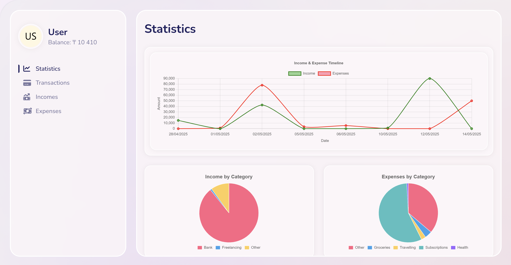
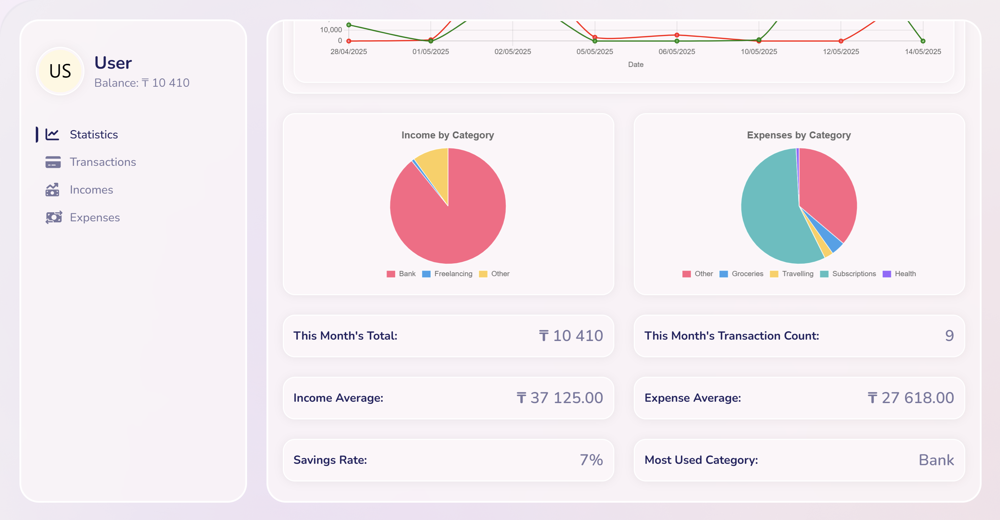
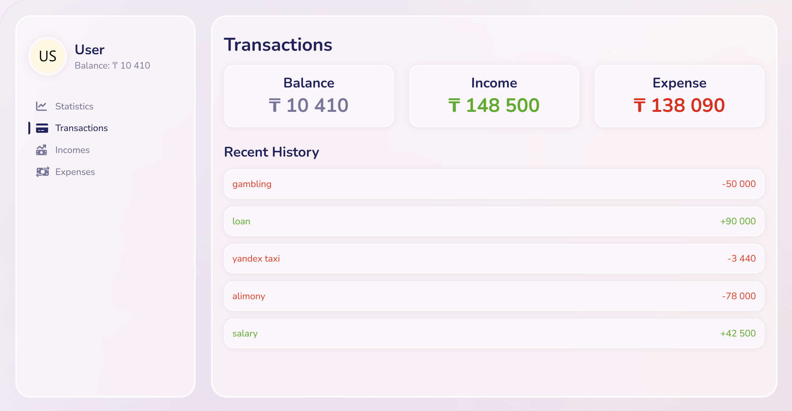
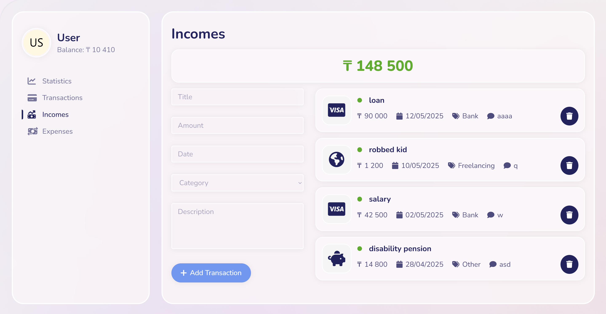
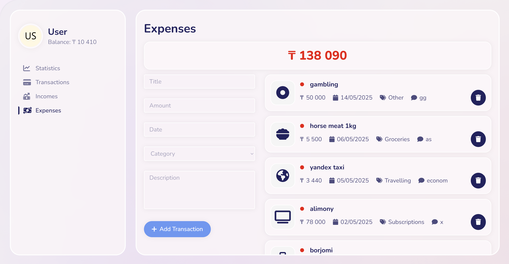

### Frontend
- React 18.2
- Axios:  HTTP client for API requests
- Context API: (Used via useGlobalContext) React's built-in state management
- styled-components: CSS-in-JS styling solution
- Chart.js and react-chartjs-2: Data visualization libraries
- Font Awesome: Icon library

### Backend
- Node.js + Express.js
- MongoDB

### Screenshots

